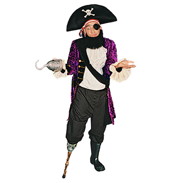
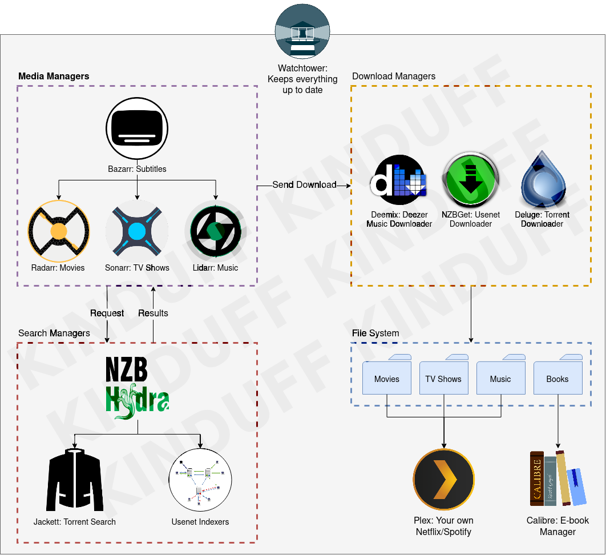

<h1 align="center">Pirate</h1>

<i>Do what you want cause a pirate is free, you are a pirate!</i>

---

This is the Docker Compose file I use to setup my pirate system. I host it on a Synology NAS, but can be setup anywhere with a few modifications.

## What does it include?

- [Sonarr][Sonarr]: To manage TV Shows.
- [Radarr][Radarr]: To manage Movies.
- [Lidarr][Lidarr]: To manage Music.
- [Bazarr][Bazarr]: To manage Subtitles for TV Shows & Movies.
- [Deluge][Deluge]: Client to download torrents.
- [NZBGet][NZBGet]: Client to download from Usenets.
- [Deemix][Deemix]: Client to download music from Deezer.
- [Calibre][Calibre]: Server to manage E-Books.
- [Jackett][Jackett]: Torrent searcher & Torznab provider.
- [NZBHydra2][NZBHydra2]: Usenet & Torznabs searcher.
- [Watchtower][Watchtower]: To keep all images up to date.

## How does it work?

If you're not familiar with the _pirate way of life_, this could be confussing, but take the following example as a reference:

1. I want to see the Shrek movie - who doesn't anyway.
1. I go to **Sonarr** and add the movie.
1. **Sonarr** will request to **NZBHydra2** the Shrek movie.
1. **NZBHydra2** will search in existing Newsnab Indexers and Torznabs from **Jackett**.
1. **Jackett** will search for torrents and return results to **NZBHydra2**.
1. **NZBHydra2** will return all the results to **Sonarr**.
1. **Sonarr** will search in the result for the best match based on your preferences.
1. **Sonarr** will send the resource either to **NZBGet** if it's a usenet file, or **Deluge** if it's a torrent.
1. **NZBGet** or **Deluge** will finish the download, **Sonarr** is watching the status.
1. **Sonarr** will mark the download as complete, and let know **Bazarr**.
1. **Sonarr** will move the downloaded file to your prefered directory, for example `Movies`.
1. **Bazarr** will search for the best subtitles based on your preferences.

After this you will end up with the Shrek movie with subtitles, you can consume it using **Plex**, but that's not included in this repository.

Same can happen with TV Shows, Music, and Books.

## What else?

Not much. This repository is not a tutorial or a guide, there's plenty of information out there. This is my personal setup, easy as cake and configurable.

## Where do you run it?

In a Synology Diskstation DS218+, including Plex, and some other stuff.

## What's up with the watermark in the diagram?

Believe it or not it took me like an hour to do it, just want to avoid being copied.

If you want the image without the watermark, open an issue and I'll be happy to sell it to you.

## License

What?

[Sonarr]: https://sonarr.tv
[Radarr]: https://radarr.video
[Lidarr]: https://lidarr.audio
[Bazarr]: https://www.bazarr.media
[Jackett]: https://github.com/Jackett/Jackett
[Deluge]: https://deluge-torrent.org
[NZBGet]: https://nzbget.net
[Deemix]: https://gitlab.com/users/RemixDev/projects
[Calibre]: https://calibre-ebook.com
[Watchtower]: https://containrrr.dev/watchtower
[NZBHydra2]: https://github.com/theotherp/nzbhydra2
